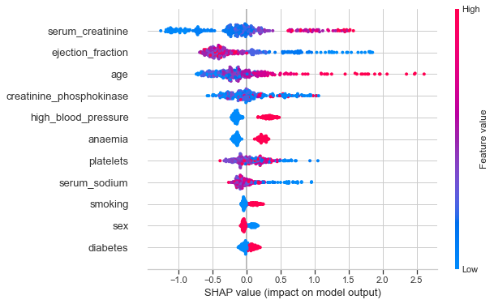
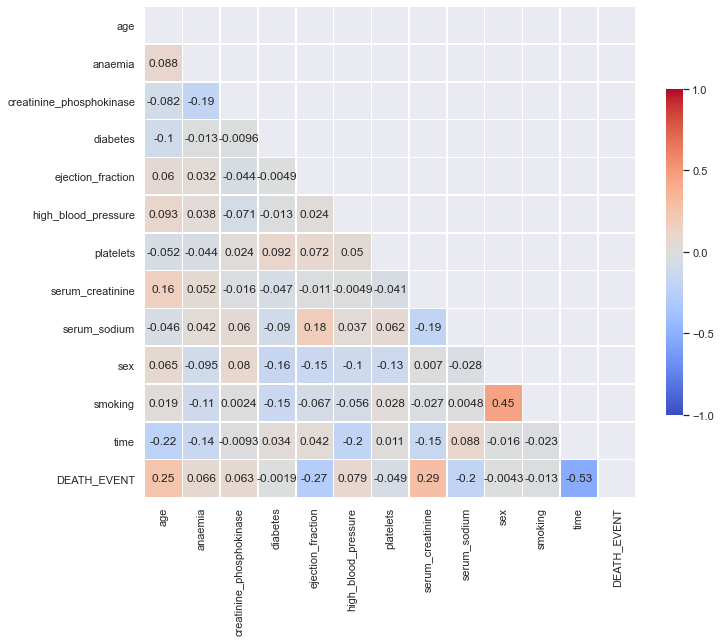
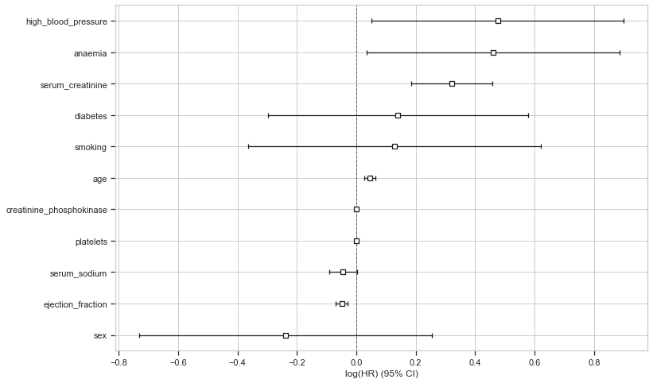
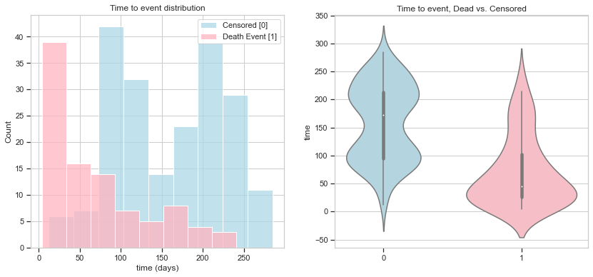
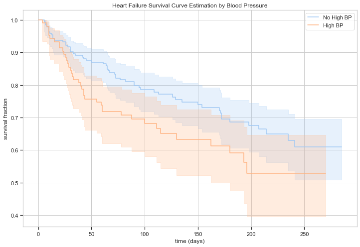
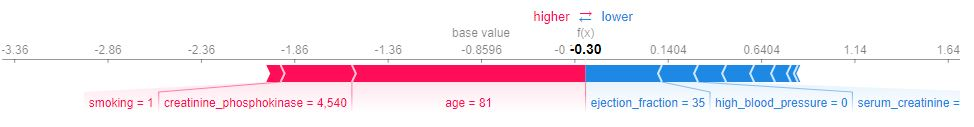

# Heart-Failure-Prediction
Predicting survival and mortality of patients based on their medical and clinical measures

The dataset used for this analysis & modelling was downloaded from Kaggle website [(link)](https://www.kaggle.com/andrewmvd/heart-failure-clinical-data).

Creditting the dataset authors:  
Davide Chicco, Giuseppe Jurman: Machine learning can predict survival of patients with heart failure from serum creatinine and ejection fraction alone. BMC Medical Informatics and Decision Making 20, 16 (2020) [(link)](https://doi.org/10.1186/s12911-020-1023-5).  
Dataset can be shared and used freely under license Attribution 4.0 International (CC BY 4.0).

Note: If the notebook fails to open, please use [this link](https://nbviewer.jupyter.org/github/ErezWasserman/Heart-Failure-Prediction/blob/main/Heart%20Failure%20Survival%20Analysis%20and%20Mortality%20Prediction.ipynb?flush_cache=true).

 | 

 | 

 | 

 | 

